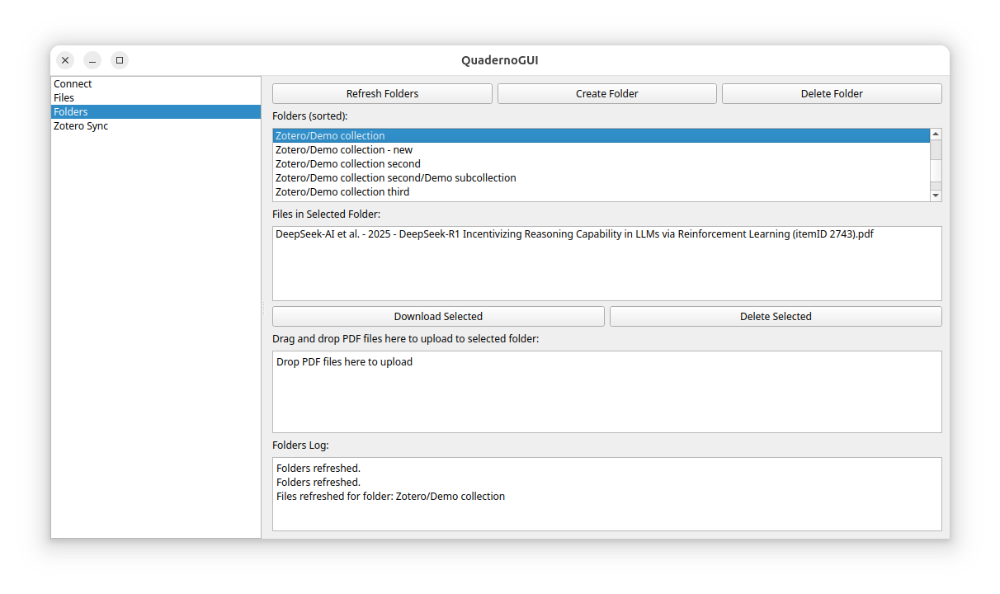
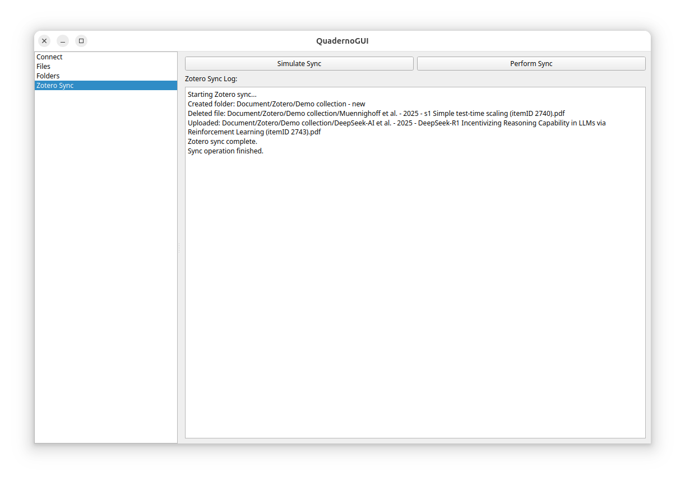

# Quaderno GUI

## Overview

Quaderno GUI is a desktop application for managing files on your digital paper device. It allows you to connect to the device, browse and organize files and folders, and synchronize with your Zotero library. Built with Python and PyQt5, it should work on Linux, Windows, and MacOS, but has only been tested with Linux.

We also support **synchronization of your Zotero library to the device**. We rely on the file renaming features of Zotero 7, this has not been tested with earlier versions of Zotero.

It communicates with your device using the [dpt-rp1-py](https://github.com/janten/dpt-rp1-py) library.

The project has been developed against Quaderno A4 2nd Gen, but it should also work with Sony DPT-RP1 given its dependancy on `dpt-rp1-py`.

## Screenshots

<div style="display: flex; justify-content: space-around; align-items: center;">
  <div style="text-align: center;">
    
    <p>Folders View</p>
  </div>
  <div style="text-align: center;">
    
    <p>Zotero Sync View</p>
  </div>
</div>


## Features

- Browse, download, delete, and upload PDF files via a user-friendly drag-and-drop interface.
- Organize files in folders and manage them directly from the GUI.
- Synchronize your `Zotero` library with your device by automatically creating or removing folders and files based on your Zotero data.
- A command-line launcher (`quaderno-gui`) is installed for easy access.

## Installation

1. Ensure you have Python 3 installed on your system.
2. Install the required Python packages (for example, PyQt5 and requests). You can do this with pip:

```bash
pip install PyQt5 dpt-rp1-py
```

3. Clone the repository and install the package locally. In the project directory, run:

```bash
pip install .
```

This will install the quaderno-gui command, which you can use to launch the application.

## Usage

After installation, start the application by running:

```bash
quaderno-gui
```

When launched, the GUI lets you enter the device address and (optionally) the serial number on the Connect page. Navigate between the Files, Folders, and Zotero Sync pages to manage your documents and sync with your Zotero library.

## Project Structure

- **main.py** – Contains the main application logic and GUI initialization.
- **pages.py** – Implements the Connect, Files, Folders, and Zotero Sync pages.
- **workers.py** – Contains background thread implementations (such as GenericWorker) for offloading network calls.
- **setup.py** – The packaging script that installs the application and creates the quaderno-gui entry point.

## Configuration and Customization

- Application settings (like device address and serial number) are stored using QSettings, ensuring they persist between sessions.
- Network request timeouts are set within the DigitalPaper class so that the UI remains responsive even if the device is unreachable.
- Configure the Zotero storage folder and database file directly on the Zotero Sync page; selections persist between sessions.

## Troubleshooting

- If the GUI becomes unresponsive when the device is offline, verify that the device is not in sleep mode.
- Check the console output for error messages related to network timeouts or failed requests.

## Contributing

Contributions to Quaderno GUI are welcome. Please submit issues or pull requests through the project's repository.

## License

Quaderno GUI is licensed under the [MIT License](LICENSE). You are free to use, modify, and distribute this project. See the `LICENSE` file for details.
